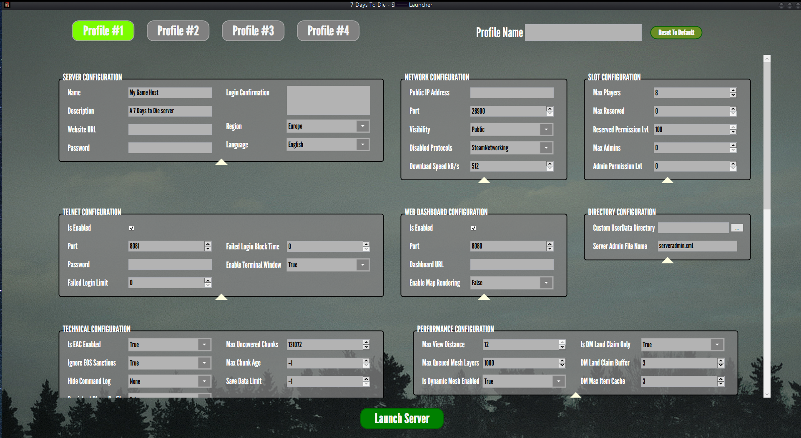

# 7 Days To Die - Server Launcher
A GUI launcher for the `serverconfig.xml` file in 7 Days to Die.

## Overview
This project provides a Windows Forms application that simplifies the process of configuring and launching a server for 7 Days to Die. With this tool, you can:

- Use a graphical interface to adjust server settings.
- Save and load profiles for different server configurations.
- Quickly switch between hosting setups for personal or group use.

## Features
- User-friendly GUI for editing `serverconfig.xml`.
- Profile management: Save, load, and copy profiles.
- Improved handling of property bindings and data persistence.
- Doesn't overwrite `serverconfig.xml` but instead, creates a `newserverconfig.xml` for launching.

---

## Change Log

### 01-12-2024 (v1.1)

#### Added:
- **Copy/Paste Buttons**: Easily copy profiles to another ID.

#### Changed:
- **ViewModel Structure**: Restructured `ViewModels` to extend from a `ViewModelBase`, allowing property view models to focus purely on their property string values.
- **Property Names**: Updated property names to match those used in the `serverconfig.xml` file.
- **Property Persistence**: Improved how properties are saved to disk. A static class now caches properties provided by each `ViewModelBase` instead of each `ViewModel` having its own saving function.
- **ComboBox Handling**: Enhanced the storage, binding, and conversion of ComboBox options. Conversion to indices now occurs during profile transfer to the game directory.

---

## How to Use
1. Launch the application from a directory of your choice.
2. Adjust settings using the GUI.
3. Save profiles for different configurations.
4. Launch the server directly from the application.

---

## Contribution
Contributions are welcome! Feel free to fork the repository, submit pull requests, or report issues.

## License
This project is licensed under the MIT License. See the `LICENSE` file for details.

