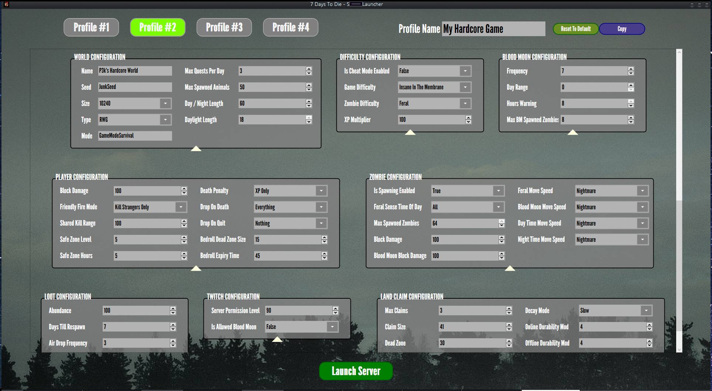

# 7 Days To Die - Server Launcher
A GUI laucher for the serverconfig.xml on 7D2D

A nice WinForm for your serverconfig.xml
Allows you to use a GUI to configure your server settings and launch it.
Save and Load profiles. (I use this when swapping between hosting for myself and my buddies)

----

## CHANGE LOG ##
	01-12-24 v1.1
	
	#Added:
		Copy / Paste buttons for copying one profile to another ID

	#Changed:
		Restructed ViewModels to extend from a ViewModelBase. This allows for property view models to contain purley their Property string values
		Changed Property names to match the ones used in the serverconfig.xml
		Changed the way Properties are saved to disk. Rather than each view model having a function called to collect properties, a static class will cache the Properties provided by each ViewModelBase 
		Changed the way ComboBox options are stored, bound and converted. Conversion to index is now done when copying the profile over to the game directory

 